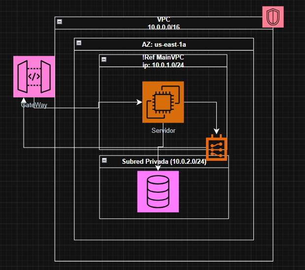

# 1. Despliegue de Infraestructura Segura en AWS

Este repositorio contiene la definición de **Infraestructura como Código (IaC)** utilizando AWS CloudFormation. Demuestra la capacidad de diseñar, aprovisionar y gestionar redes en la nube siguiendo las mejores prácticas del *AWS Academy Cloud Foundations*.

## 2. Arquitectura del Proyecto
El código automatiza la creación de un entorno seguro preparado para alojar aplicaciones Full Stack:
- **VPC Personalizada:** Aislamiento de red (CIDR 10.0.0.0/16).
- **Subredes Estratégicas:** Configuración pública para instancias **EC2** (Frontend/API) y preparada para subredes privadas para bases de datos relacionales (**Amazon RDS**).
- **Enrutamiento:** Implementación de Internet Gateway para acceso externo controlado.

## 3. Stack Tecnológico
- **Cloud Provider:** Amazon Web Services (AWS)
- **IaC:** AWS CloudFormation (YAML)
- **Componentes:** VPC, Subnets, IGW, Route Tables.

## 4. Autor
**Alejandro Gonzalez Veliz**
*Estudiante de Ingeniería en Informática | Especialista Cloud & Full Stack*

> *Nota: Este código está diseñado para ser ejecutado en la capa gratuita (Free Tier) de AWS a través de la consola de CloudFormation o AWS CLI.*
